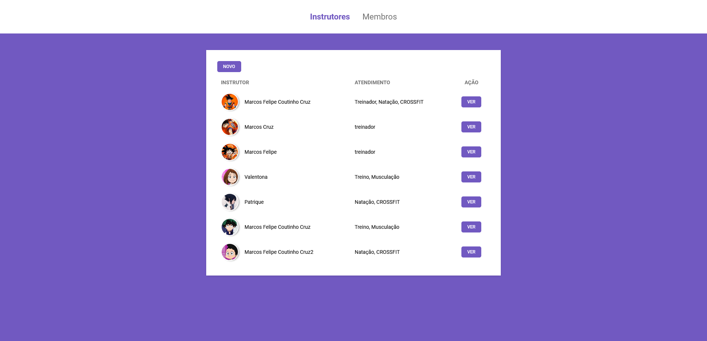
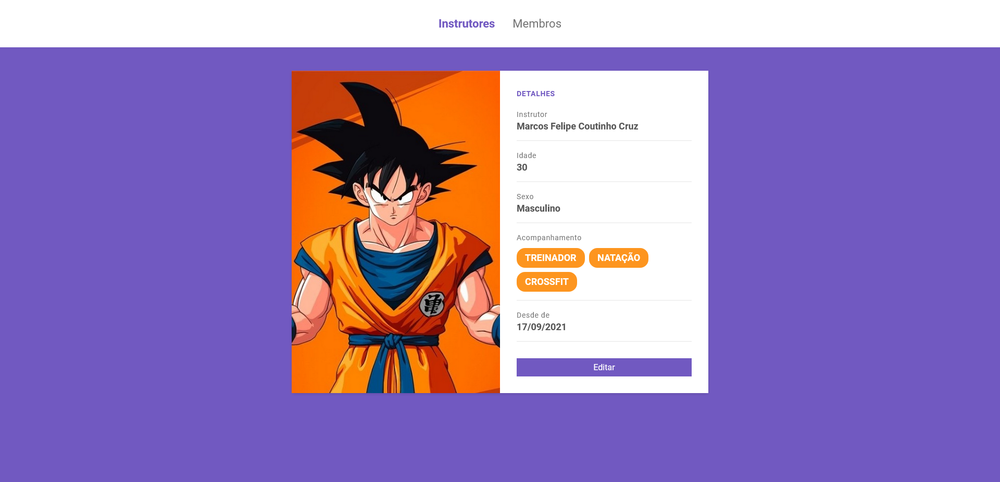
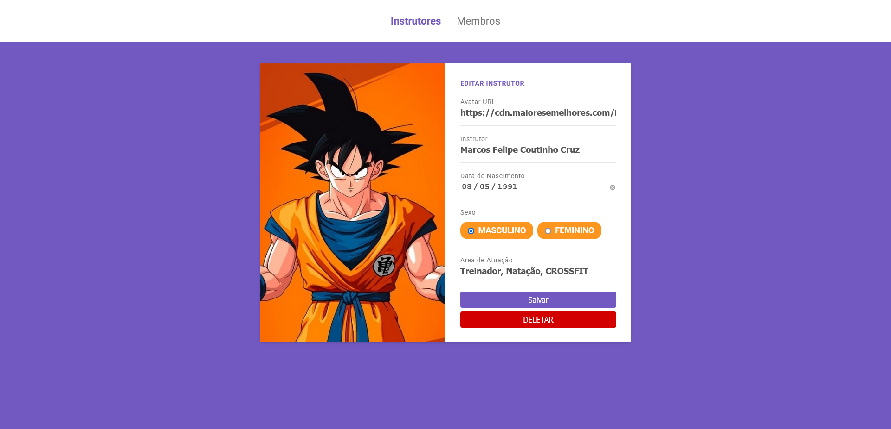
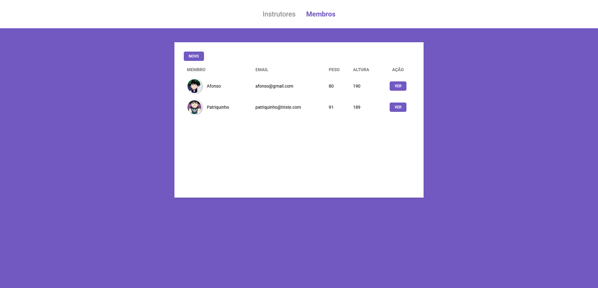
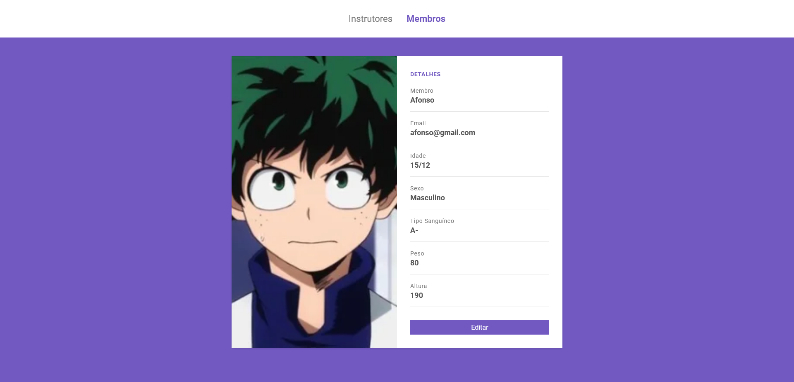
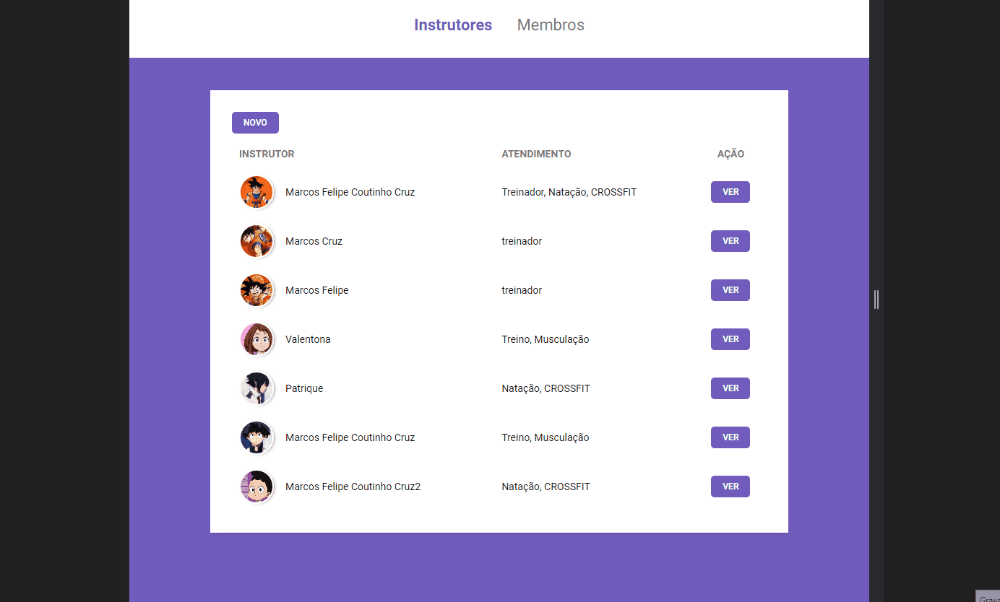

# Launch_Base: Sistema_de_Academia

 

# Tecnologias usadas

### -HTML- -SCSS- -JavaScript- -Nunjucks- -NodeJs-

 

## Sistema para academia?

É um site desenvolvido através das videos aulas assistidas da rocketseat, aqui foi nos passado o conceito de oque é um C.R.U.D. <i>Create, Read, Update, Delete</i>.

As informação passada pelo usuário na hora de se cadastrar, é recebida pelo req.body e repassado para um arquivo interno JSON. Após isso, temos total liberdade para ler, atualizar ou deletar os dados.

     <h1> Apresentação </h1>

 
 
 
 
 
 

 

     <h1> Responsivo </h1>

